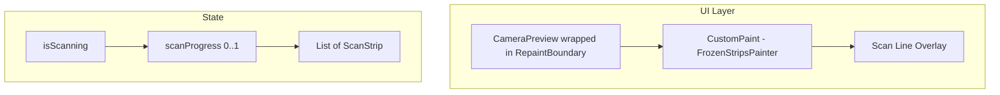
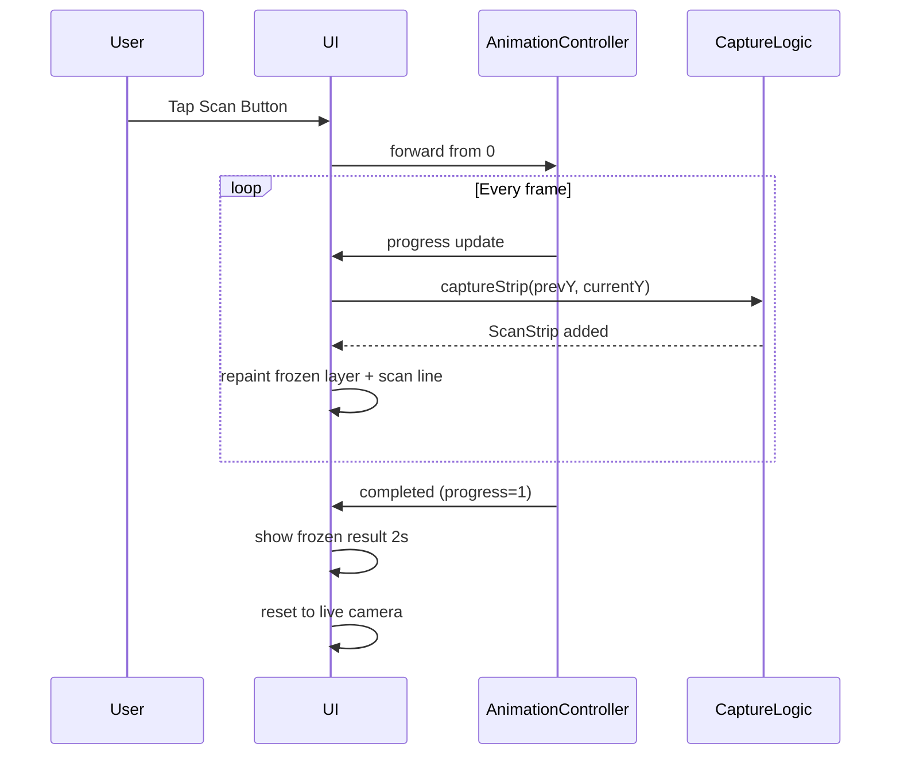

# Time Wrap Scan – Implementation Plan

## Overview
Implement a "time wrap scan" effect where a scan line moves from top to bottom over 2 seconds. As the line descends, the region above it freezes (captured from the live camera), while the region below remains live. After the scan completes, the frozen result is displayed briefly, then the view resets to live camera.

---

## Requirements Summary
| Aspect | Detail |
|--------|--------|
| Direction | Top → Bottom |
| Duration | 2 seconds |
| Freeze behavior | Progressive strip capture; top region frozen, bottom live |
| Post-scan | Display frozen result ~2 s, then auto-reset to live |

---

## Architecture Diagram



---

## Data Model

### `ScanStrip`
```dart
class ScanStrip {
  final ui.Image image;
  final double top;      // y position in logical pixels
  final double height;   // strip height
  ScanStrip({required this.image, required this.top, required this.height});
}
```

---

## State Variables (in `_CameraScreenState`)

| Variable | Type | Purpose |
|----------|------|---------|
| `_boundaryKey` | `GlobalKey` | Key for `RepaintBoundary` to capture frames |
| `_strips` | `List<ScanStrip>` | Accumulated frozen strips |
| `_isScanning` | `bool` | Guard to prevent re-entry |
| `_scanController` | `AnimationController` | Drives 0→1 over 2 s |
| `_scanAnimation` | `Animation<double>` | Tween for progress |

---

## Key Methods

### `_startScan()`
1. Set `_isScanning = true`, clear `_strips`.
2. Start `_scanController.forward(from: 0)`.

### `_onScanTick()`
Listener on `_scanController`:
1. Compute current Y = progress × screenHeight.
2. Capture strip from previous Y to current Y via `_captureStrip()`.
3. Call `setState` to repaint.

### `_captureStrip(double fromY, double toY)`
1. Use `_boundaryKey.currentContext!.findRenderObject()` → `RenderRepaintBoundary`.
2. Call `boundary.toImage()` to get full frame.
3. Crop the strip (fromY..toY) using `Canvas` + `PictureRecorder`.
4. Add resulting `ui.Image` to `_strips`.

### `_onScanComplete()`
1. Wait ~2 s (or configurable).
2. Clear `_strips`, set `_isScanning = false`.
3. `setState` to show live camera again.

---

## Widget Tree (build method)

```
Scaffold
└─ Stack
   ├─ RepaintBoundary(key: _boundaryKey)
   │   └─ CameraPreview
   ├─ CustomPaint(painter: FrozenStripsPainter(_strips))
   ├─ Positioned (scan line at _scanAnimation.value * height)
   └─ Align (bottom) → Scan Button
```

---

## `FrozenStripsPainter`

```dart
class FrozenStripsPainter extends CustomPainter {
  final List<ScanStrip> strips;
  FrozenStripsPainter(this.strips);

  @override
  void paint(Canvas canvas, Size size) {
    for (final strip in strips) {
      canvas.drawImage(strip.image, Offset(0, strip.top), Paint());
    }
  }

  @override
  bool shouldRepaint(covariant FrozenStripsPainter old) => true;
}
```

---

## Animation / Timing Flow



---

## File Changes

| File | Changes |
|------|---------|
| [`lib/camera_screen.dart`](../lib/camera_screen.dart) | Add state vars, `ScanStrip` class, `FrozenStripsPainter`, capture logic, updated `build()` |

No new dependencies required; uses `dart:ui` for image manipulation.

---

## Checklist

- [ ] Add `GlobalKey` for `RepaintBoundary`
- [ ] Define `ScanStrip` model
- [ ] Implement `FrozenStripsPainter`
- [ ] Implement `_captureStrip` with cropping
- [ ] Wire `AnimationController` (2 s duration)
- [ ] Update `build` to layer frozen strips + scan line
- [ ] Implement reset flow after scan completes
- [ ] Test on device/emulator

---

## Notes
- `RepaintBoundary.toImage()` is async; ensure proper await handling.
- Consider performance: limit strip count or merge strips periodically.
- Dispose `ui.Image` objects when clearing `_strips` to free memory.
